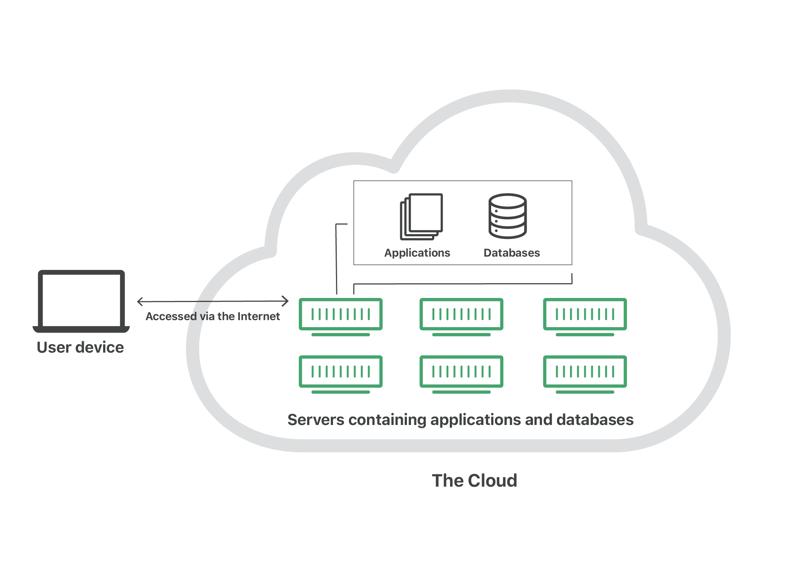
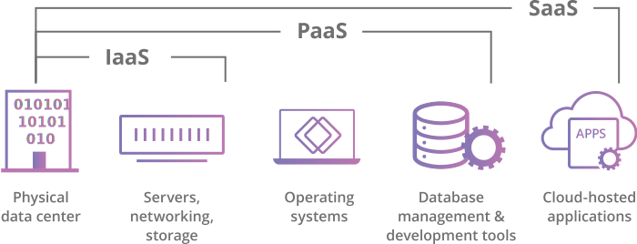

>软件正在吞噬世界。
>
>——Mark Andreessen

# 什么是云？

**先来讲讲什么是云。为什么将计算方式称为“云”？**

**“云”** 最初是科技行业内的一个俗称。在 Internet 的早期，技术图通常用云朵来表示组成 Internet 的服务器和网络基础设施。随着越来越多的计算进程迁移到 Internet 中的这种“服务器和基础设施”部分，人们开始将“迁移到云”作为表达计算进程发生位置的一种简写方式。如今，“云”已成为这种计算方式广为接受的代名词。

著名的云服务厂商**Cloudflare**是这么定义云的：
>“云”是通过互联网访问的服务器，以及在这些服务器上运行的软件和数据库。云服务器分布在全球各地的数据中心中。通过使用云计算，用户和公司不必自己管理物理服务器或在自己的机器上运行软件应用程序。

云使用户可以从几乎所有设备访问相同的文件和应用程序，因为计算和存储是在数据中心的服务器上进行，而不是在用户设备上（本地）进行。这就解释了为什么用户可以在旧手机坏了后在新手机上登录自己的某个软件帐户并仍能找到旧帐户及其包含的所有照片、视频和对话记录。它与Gmail或Microsoft Office 365 等云电子邮件提供商以及 Dropbox 或 Google Drive 等云存储提供商的工作方式相同。
对于企业而言，转换为云计算可以削减一些 IT 成本和开销：例如，不再需要更新和维护自己的服务器，因为他们选用的云供应商会做这些工作。这对于那些可能无力负担自己的内部基础设施，但可以通过云以经济实惠的价格将其基础设施需求外包的小型企业来说，影响尤为显著。有了云，员工和客户可以从任何位置访问相同的文件和应用程序，因此，可以使公司更轻松地进行跨国经营。

# 云计算的主要服务模型有哪些？

按照对外提供的内容或者粒度区分，主要提供分了如下几种服务：
* **软件即服务（SaaS）**：`Saas`应用程序托管在云服务器上且用户可通过 Internet 访问它们，因此，不需要用户在自己的设备上安装应用程序。SaaS 就像租房子：房东负责维护房屋，但是租户通常可以像使用自己的房屋一样进行使用。在这种模式下，客户直接看到的是软件

* **平台即服务（PaaS）**：在这种服务模型中，公司不需要为托管应用程序付费，而是需要为构建自己的应用程序时所需的事物付费。PaaS 供应商提供通过Internet构建应用程序所需的一切，包括开发工具、基础设施和操作系统。PaaS 可以比作租用建造房屋所需的所有工具和设备，而不是租用房屋本身。最著名的Pass供应商就是Microsoft Azure。
* **基础设施即服务（IaaS）**：在这种服务模型中，公司从云提供商那里租用所需的服务器和存储空间。然后，使用该云基础设施构建自己的应用程序。IaaS就像一家公司租用一块土地，该公司可以在这块土地上建设所需的一切，但是需要自己提供所需的建筑设备和材料。IaaS 提供商包括Google Compute Engine，OpenStack、阿里云等等。

在以前，SaaS、PaaS 和 IaaS 是云计算的三个主要服务模型，并且基本上所有云服务都属于这些类别之一。但是，最近几年出现了第四种服务模型——**功能即服务（FaaS）**：

FaaS也称为无服务器计算，它将云应用程序分解为更小的组件，这些组件仅在需要时运行。想象一下，是否可以一次只租房屋的一小部分：例如，租户只在晚餐时支付餐厅费用、睡觉时支付卧室费用，看电视时支付客厅费用，而当他们不使用这些房间时，就不必支付租金。

当然，FaaS应用程序仍然是在服务器上运行，云计算的上述所有服务模型都是如此。但是，之所以被称为“无服务器”，是因为它们没有在指定计算机上运行，而且构建应用程序的公司不必管理任何服务器。此外，随着使用该应用程序的人不断增加，无服务器功能变得也可扩展或复制。想象一下，在有更多的人来吃晚饭时，租户的餐厅可以按需扩展的情景。

# 云部署有哪些不同类型？
与上面讨论的定义如何通过云提供服务的模型相比，这些不同的云部署类型与云服务器的位置以及由谁管理有关。

最常见的云部署有：

* **私有云**： 私有云是完全由某个组织专用的服务器、数据中心或分布式网络。

* **公有云：** 公有云是外部供应商运行的服务，可能包括位于一个或多个数据中心的服务器。与私有云不同，公有云由多个组织共享。通过使用虚拟机，不同的公司可以共享单台服务器，这种情况称为“多租户模式”，因为有多个租户在租用同一台服务器内的服务器空间。
  
* **混合云：** 混合云部署结合了公有云和私有云，甚至可能包括本地部署的传统服务器。组织可以将其私有云用于某些服务，将其公有云用于其他服务，或者可以将公有云用作私有云的备份。
  
* **多云**：多云是一种使用多个公有云的云部署。换句话说，拥有多云部署的组织从多个外部供应商那里租用虚拟服务器和服务。若继续沿用上文的类比方法，这种云部署就像是从不同的房东那里租了几块相邻的土地。多云部署也可以是混合云，反之亦然。

# 云计算的最重要的基本特征
- **资源池化**。云端计算资源需要被池化，以便通过多租户形式共享给多个消费者，也只有池化才能根据消费者的需求动态分配或再分配各种物理的和虚拟的资源。消费者通常不知道自己正在使用的计算资源的确切位置，但是在自助申请时允许指定大概的区域范围（比如在哪个国家、哪个省或者哪个数据中心）。

- **快速弹性。** 消费者能方便、快捷地按需获取和释放计算资源，也就是说，需要时能快速获取资源从而扩展计算能力，不需要时能迅速释放资源以便降低计算能力，从而减少资源的使用费用。对于消费者来说，云端的计算资源是无限的，可以随时申请并获取任意数量的计算资源。但是我们一定要消除一个误解，那就是一个实际的云计算系统不一定是投资巨大的工程，也不一定要购买成千上万台计算机，也不一定具备超大规模的运算能力。云端建设方案一般采用可伸缩性策略，刚开始时采用几台计算机，以后根据用户数量规模来弹性增减机器数量。

其他的特征还包括：
- **广泛的网络访问。** 消费者可以随时随地使用任何云终端设备接入网络并使用云端的计算资源。常见的云终端设备包括手机、平板电脑、笔记本电脑、PDA掌上电脑和台式计算机等。 
- **自助服务。** 消费者不需要或很少需要云服务提供商的协助，就可以单方面按需获取并使用云端的计算资源。
- **可计量计费。** 能根据某类资源（如存储、CPU、内存、网络带宽等）的使用量和时间长短计费，也可以按照每使用一次多少钱来计费。

参考资料
* [cloudflare:what-is-the-cloud?](https://www.cloudflare.com/zh-cn/learning/cloud/what-is-the-cloud/) 