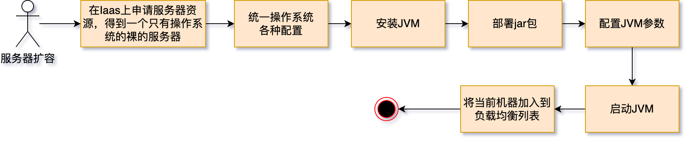

云计算最重要的特性就是资源池化。

在谈资源池池化之前，需要先谈一下虚拟机。

虚拟机是一种技术，可让用户以单个物理硬件系统为基础，创建多个模拟环境或专用资源。虚拟机就是一种最常见的方式：将单个服务器硬件虚拟成多个虚拟机VM。
VM运行的是完整的操作系统（包括其自己的内核）， 通过“伪造”一个硬件抽象接口，将一个操作系统以及操作系统层以上的层嫁接到硬件上，实现和真实物理机几乎一样的功能。比如我们在一台 Windows 系统的电脑上使用 Android 虚拟机，就能够用这台电脑打开 Android 系统上的应用。
虚拟机是存在于硬件层和操作系统层间的虚拟化技术。VM是一项古老的技术，很早就存在了。

但是虚拟机不是池化：
* 虚拟机是单机上操作的。于单个服务器的CPU、内存、硬盘资源颗粒度较小，因此在虚拟化应用中，经常出现资源配置空洞，要么是CPU核数没有分配完，要么是内存没有分配完，更多的情况是硬盘容量存在大量空闲。

**资源池化要相当于将整个服务器集群看成一个大的服务器，给不同的租户按需部署。虚拟机可以运行在资源池化之上**。

# 资源池化的两种方向

一开始的资源池化就是传统的IaaS服务：消费者使用“基础运算资源”，如处理能力、储存空间、网络元件或中介软体。消费者能掌控作业系统、储存空间、网络元件（如防火墙、负载平衡器等），但并不掌控云端基础架构
在这上面用户使用的直接的硬件资源——比如在阿里云上申请云服务器。最著名的云计算平台就是`OpenStack`。

>OpenStack是一个自由、开源的云计算平台。它主要作为基础设施即服务（IaaS）部署在公用云和私有云中，提供虚拟服务器和其他资源给用户使用。[3]该软件平台由相互关联的组件组成，控制着整个数据中心内不同的厂商的处理器、存储和网络资源的硬件池。用户可以通过基于网络的仪表盘、命令行工具或RESTful网络服务来管理。

一个典型的基于Iaas的扩容流程是这样的：

可以看到这个缺点很明显的：
* 在Iaas上申请资源的速度较慢，**因为要完全部署一个全新的操作系统！相当于是创建一个虚拟机**；
* 运行一个独立操作系统的巨大的性能损耗；
* 整个流程冗长，一般的操作可能都要十几分钟；
* 必须要运维参与，编写复杂流程脚本，开发人员无法自主完成；
此外，由于申请的是服务器，其实无论是运维还是开发都可以登录上去进行临时操作，修改变量等等，在造成了集群难以维护。
  这个就是在云原生领域所极力避免的 **"可变基础设施"** 。

如果是小公司，这么做是没有什么大问题的。但是对于一个拥有几十个系统、管理至少上千台台机器、每天都要进行数次甚至数十次发布的的互联网公司，
这样做效率就很低了，更不要说像Google这样数百万服务器，上万个服务的公司了。

第二种就是容器技术。正是传统的基于Iaas的云计算的缺点，容器这种"古老"的技术，又换发了第二春。 容器是一种非常轻量化的虚拟方式，启动快，占用资源少，能够直接将所需的配置一键打包成一个"集装箱"进行部署，不需要再部署一个重型的类似于OpenStack这样的云计算平台。基本上弥补了Iaas这样的云计算方式的缺点，因此容器这种方式大行其道。

但是为什么要容器而不是虚拟机

首先：云计算是支持虚拟机的。

因此，大多数云环境都是跟容器挂钩的。我们不需要OpenStack这样的重量级的IaaS服务。

#容器VS虚拟机

## 容器体系结构
容器是一个隔离的轻型接收器，用于在主机操作系统上运行应用程序。 容器在主机操作系统的内核（可以将其视为操作系统的隐藏管道）上构建，只包含应用和一些轻型操作系统 API 以及在用户模式下运行的服务，如下图所示。

## 虚拟机体系结构
与容器不同，VM 运行的是完整的操作系统（包括其自己的内核），如下图所示。

https://www.redhat.com/zh/topics/cloud-computing/cloud-vs-virtualization
https://learn.microsoft.com/zh-cn/virtualization/windowscontainers/about/containers-vs-vm
https://developer.aliyun.com/article/185614
